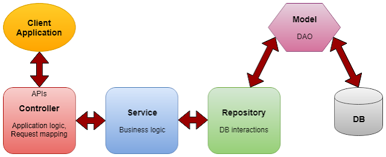
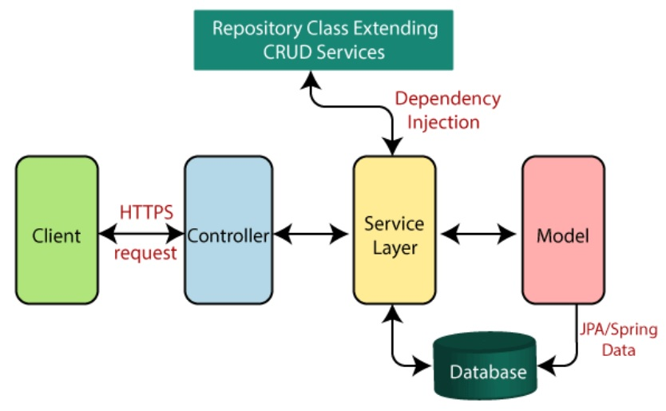
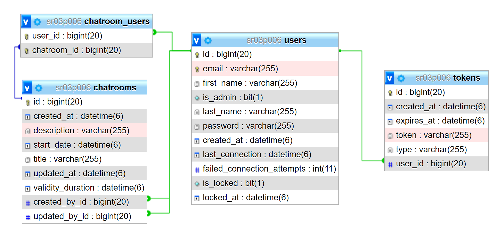
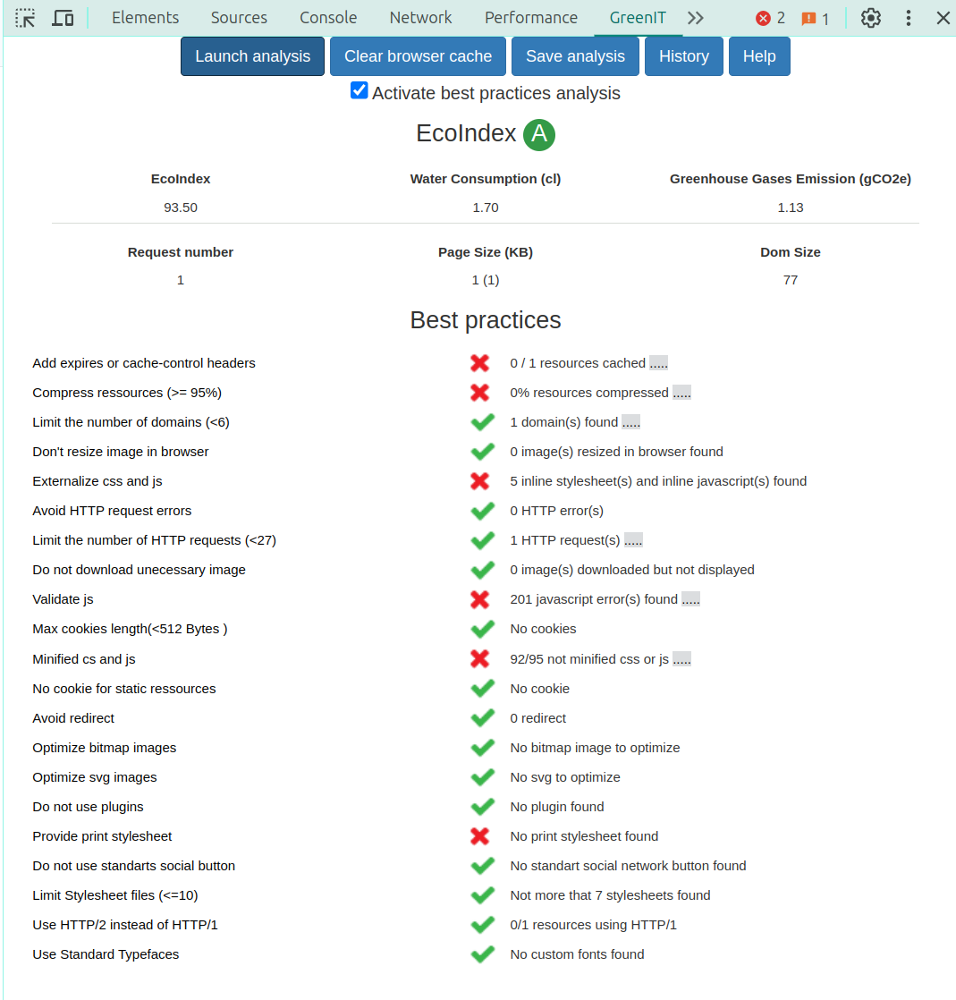

# SR03 - Application de Chat

Ce README concerne le développement d'une application de salon de discussion. Dans cette application, chaque utilisateur a la possibilité de créer un canal de discussion à une date spécifique, avec une durée de validité définie, et d'inviter au moins un autre utilisateur à y participer.

La partie administrateur développée en Spring Boot offre la possibilité de gérer les utilisateurs. De plus, elle fournit une API REST destinée à être utilisée par la partie client développée en React.

Le code source du projet est disponible à l'adresse suivante : [https://gitlab.utc.fr/amoudoug/sr03-spring-chat-app](https://gitlab.utc.fr/amoudoug/sr03-spring-chat-app). La version finale du projet est située sur la branche `main` et est identifiée comme la version 2.0.1.

Le projet a été développé par Nam Khanh NGUYEN et Adhavane MOUDOUGANNANE pour le cours SR03 à l'Université de Technologie de Compiègne.

## Installation

Le projet a été développé sur les systèmes d'exploitation Windows 11 et Ubuntu 24.04 LTS. Les outils utilisés comprennent Visual Studio Code en tant qu'éditeur de code principal.

Les dépendances suivantes sont nécessaires pour lancer le projet :

- Java Development Kit 21 (JDK 21)
- Maven 3.2.0
- Node.js 20.13.1
- npm 10.8.1
- React 18.3.1

Pour lancer le projet, vous devez d'abord cloner le dépôt en utilisant la commande suivante :

```bash
git clone https://gitlab.utc.fr/amoudoug/sr03-spring-chat-app.git
cd sr03-spring-chat-app
```

Il est très important de noter que vous devez modifier ou créer le fichier `.env` dans le répertoire `chatapp` pour y insérer des identifiants valides pour le serveur de base de données. Un exemple de fichier `.env` est fourni sous le nom `.env.example` pour vous guider dans la création du fichier `.env`. Le fichier .env est utilisé pour charger les variables d'environnement dans le projet Spring. Ces variables sont ensuite utilisées dans le fichier application.properties.

```bash
MYSQL_HOST=localhost
MYSQL_USER=root
MYSQL_PASSWORD=yourpassword
MYSQL_DATABASE=chatapp
MYSQL_PORT=3306

JWT_SECRET=thisisasamplesecret
JWT_ACCESS_EXPIRATION_MS=900000
JWT_REFRESH_EXPIRATION_MS=2592000000
JWT_RESET_PASSWORD_EXPIRATION_MS=600000
JWT_VERIFY_EMAIL_EXPIRATION_MS=600000

SMTP_PROTOCOL=smtps
SMTP_HOST=smtps.utc.fr
SMTP_PORT=465
SMTP_USERNAME=login@AD
SMTP_PASSWORD=password
EMAIL_FROM=support@yourapp.com
```

Les identifiants de la base de données utilisés pour le développement de l'application sont les suivants :

```bash
MYSQL_HOST=tuxa.sme.utc
MYSQL_USER=sr03p006
MYSQL_PASSWORD=PyP9u50hFvlU
MYSQL_DATABASE=sr03p006
MYSQL_PORT=3306
```

Pour configurer l'envoi de mails pour la réinitialisation du mot de passe et la vérification de l'email, vous devez modifier les paramètres SMTP dans le fichier `.env`. Pour obtenir ces informations, nous vous recommandons de suivre les instructions détaillées fournies par l'Université de Technologie de Compiègne. Vous pouvez trouver ces instructions sur leur site web à l'adresse suivante : [https://5000.utc.fr/front/helpdesk.faq.php?id=59](https://5000.utc.fr/front/helpdesk.faq.php?id=59).

## Utilisation

### Serveur

**ATTENTION :** N'oublier pas de modifier le fichier `.env` dans le répertoire `chatapp` pour y insérer des identifiants valides pour le serveur de base de données.

Pour lancer le backend Spring, veuillez vous rendre dans le répertoire `chatapp`, puis exécuter la commande suivante :

```bash
cd chatapp # depuis le répertoire sr03-spring-chat-app
./mvnw spring-boot:run
```

Le projet a également été configuré avec un environnement de développement. Nous aborderons cette partie plus tard, mais il est important de noter que l'interface administrateur utilise TailwindCSS qui est bundlé avec Webpack. Ainsi, si vous souhaitez que l'interface se mette à jour automatiquement lors de la modification des templates HTML, vous devez lancer le serveur de développement avec la commande suivante :

```bash
npm run start # depuis le répertoire chatapp
```

Cela ouvrira un serveur de développement sur le port 9000 qui va proxyfier les requêtes vers le backend Spring sur le port 8080. Vous pourrez accéder à l'interface admin en utilisant l'URL suivante : [http://localhost:9000](http://localhost:9000).

Dans le cas où vous souhaitez bénéficier d'un environnement de développement pour l'interface administrateur, vous pouvez suivre les étapes mentionnées précédemment. Sinon, pour accéder à l'interface admin directement via le backend Spring, vous pouvez utiliser l'URL suivante : [http://localhost:8080](http://localhost:8080) après avoir lancé le backend Spring avec la commande `./mvnw spring-boot:run`. Dans les deux cas, il est impératif d'exécuter `./mvnw spring-boot:run`.

### Client

Voici quelques rappels concernant les dépendances nécessaires pour le frontend :

- Assurez-vous d'avoir Node.js installé sur votre machine, de préférence dans la version 20.13.1, car le projet a été testé avec cette version.
- Utilisez la version 18.3.1 de React, car la dépendance TanStack React Query v5 nécessite cette version spécifique.
- Pour le build du projet, nous utilisons Vite.js et non Webpack. Par conséquent, pour accéder au projet localement, utilisez [http://localhost:5173](http://localhost:5173) ou [http://localhost:4173](http://localhost:4173) plutôt que [http://localhost:3000](http://localhost:3000).

Pour permettre au frontend de communiquer avec le serveur, vous devez d'abord démarrer le serveur en backend. Suivez les instructions fournies dans la section précédente pour lancer le backend Spring.

```bash
cd chatapp # depuis le répertoire sr03-spring-chat-app
nano .env # modifier les identifiants de la base de données
./mvnw spring-boot:run
```

Pour lancer le frontend, veuillez vous rendre dans le répertoire `client`, puis exécuter la commande suivante :

```bash
cd client # depuis le répertoire sr03-spring-chat-app
```

Pour installer les dépendances, exécutez la commande suivante :

```bash
npm install
```

Pour lancer l'application en mode développement, exécutez la commande suivante :

```bash
npm run dev
```

Vous pouvez accéder à l'application en utilisant l'URL suivante : [http://localhost:5173](http://localhost:5173). Si vous souhaitez lancer l'application en mode production, vous pouvez exécuter la commande suivante :

```bash
npm run build # lance le build de production
npm run serve # lance le serveur de production
```

## Table des matières

- [SR03 - Application de Chat](#sr03---application-de-chat)
  - [Installation](#installation)
  - [Utilisation](#utilisation)
    - [Serveur](#serveur)
    - [Client](#client)
  - [Table des matières](#table-des-matières)
  - [Partie Serveur : Interface d'administration et API REST](#partie-serveur--interface-dadministration-et-api-rest)
    - [Strcuture du serveur](#strcuture-du-serveur)
    - [Architecture du serveur](#architecture-du-serveur)
    - [Couche de données](#couche-de-données)
      - [Persistance](#persistance)
      - [Accès aux données](#accès-aux-données)
      - [*Data Transfer Object* (DTO)](#data-transfer-object-dto)
      - [*Mappers*](#mappers)
    - [Sécurité](#sécurité)
      - [Authentification](#authentification)
      - [Autorisation](#autorisation)
      - [Oubli de mot de passe](#oubli-de-mot-de-passe)
    - [Gestions des utilisateurs](#gestions-des-utilisateurs)
      - [Création d'un utilisateur](#création-dun-utilisateur)
      - [Modification d'un utilisateur](#modification-dun-utilisateur)
      - [Liste des utilisateurs](#liste-des-utilisateurs)
      - [Détails d'un utilisateur](#détails-dun-utilisateur)
      - [Suppression d'un utilisateur](#suppression-dun-utilisateur)
      - [Activation/Désactivation d'un utilisateur](#activationdésactivation-dun-utilisateur)
    - [Vues et interfaces](#vues-et-interfaces)
      - [Thymeleaf et templates](#thymeleaf-et-templates)
      - [Styles et design](#styles-et-design)
    - [API REST](#api-rest)
      - [Endpoints](#endpoints)
      - [Swagger UI](#swagger-ui)
  - [Partie Client : Application de Chat](#partie-client--application-de-chat)
    - [Architecture du client](#architecture-du-client)
    - [Structure du client](#structure-du-client)
    - [Technologies utilisées](#technologies-utilisées)
      - [Composants React](#composants-react)
      - [Backend Spring](#backend-spring)
      - [Communication WebSocket](#communication-websocket)
    - [Spécifications](#spécifications)
      - [Chatroom](#chatroom)
      - [Rafraîchissement des données](#rafraîchissement-des-données)
    - [Fonctionnalités](#fonctionnalités)
      - [Cahier des charges](#cahier-des-charges)
      - [Fonctionnalités supplémentaires](#fonctionnalités-supplémentaires)
    - [Eco Index](#eco-index)

## Partie Serveur : Interface d'administration et API REST

La partie serveur implique le développement de la gestion des utilisateurs, incluant la création, la modification, l'activation/désactivation et la suppression d'utilisateurs, ainsi que la récupération de la liste des utilisateurs avec pagination, et autres fonctionnalités requises par le cahier des charges. Conformément aux exigences spécifiées, aucune interface administrateur n'est proposée pour la gestion des salons de discussion.

### Strcuture du serveur

La structure du projet Spring est organisée comme suit :

- `src/main/java` : Contient les fichiers Java du projet.
- `src/main/resources` : Contient les fichiers de ressources du projet.
  - `src/main/resources/templates` : Contient les templates HTML de l'interface administrateur.
  - `src/main/resources/static` : Contient les fichiers statiques de l'interface administrateur (CSS, JS, images...).
  - `src/main/resources/application.properties` : Contient les configurations de l'application Spring.

Dans le répertoire `src/main/java`, les packages sont structurés de la manière suivante :

- `config` : Contient les fichiers de configuration de l'application Spring.
- `controller` : Contient les contrôleurs qui gèrent les requêtes HTTP de l'interface administrateur.
- `domain` : Contient les classes métiers annotées `@Entity` de l'application Spring.
- `mapper` : Contient les *mappers* qui convertissent les classes métiers en DTO et vice versa.
- `model` : Contient les *Data Transfer Objects* (DTO) utilisés par les contrôleurs.
- `repos` : Contient les classes de couche d'accès aux données de l'application Spring.
- `rest` : Contient les `@RestController` qui gèrent les requêtes REST de l'API REST.
- `service` : Contient les services `@Service` qui gèrent la logique métier de l'application Spring.
- `util` : Contient les classes utilitaires, souvent annotées `@Component`.

### Architecture du serveur

L'interface d'administration de l'application suit l'architecture MVC (Modèle-Vue-Contrôleur), renforcée par l'utilisation de services et de DTO (*Data Transfer Objects*).

- Les services sont des classes qui encapsulent la logique métier de l'application. Ils traitent les requêtes provenant des contrôleurs, effectuent les opérations nécessaires sur les données, et retournent les résultats aux contrôleurs.

- Les DTO sont des classes qui servent à transférer les données entre les contrôleurs et les services. Ils représentent généralement des structures de données simplifiées et spécifiques à un contexte, permettant ainsi de mieux contrôler les données échangées entre les différentes couches de l'application.

- Les contrôleurs sont des classes qui gèrent les requêtes HTTP de l'interface d'administration. Ils interceptent les requêtes entrantes, utilisent les services appropriés pour effectuer les opérations métier nécessaires, puis retournent les réponses appropriées aux clients.




*Figure 1. Architecture MVC*

En utilisant cette structure, l'application bénéficie d'une meilleure séparation des préoccupations, ce qui la rend plus modulaire, maintenable et extensible.

Par exemple, lorsqu'une requête de création d'utilisateur est reçue par le contrôleur `UserController`, celui-ci fait appel au service `UserService` pour effectuer cette opération. Le service `UserService`, à son tour, utilise le repository `UserRepository` pour enregistrer l'utilisateur dans la base de données en utilisant JPA et Hibernate. Dans certains cas, le contrôleur peut fournir un DTO au service, qui peut utiliser un mapper pour convertir ce DTO en une classe métier appropriée. Cette approche permet de séparer clairement les responsabilités entre les différentes couches de l'application, rendant le code plus lisible, maintenable et sécurisé. Cette architecture est suivie pour toutes les opérations CRUD car elle offre une robustesse et une sécurité accrues.

### Couche de données

#### Persistance

Nous utilisons une base de données MySQL fournie par l'Université de Technologie de Compiègne. Pour cela, nous avons la dépendance suivante dans le fichier `pom.xml` :

```xml
<dependency>
    <groupId>mysql</groupId>
    <artifactId>mysql-connector-java</artifactId>
    <scope>runtime</scope>
</dependency>
```

Dans notre base de données, nous avons trois tables : `users`, `chatrooms` et `chatroom_users`. La table `users` contient les informations des utilisateurs, la table `chatrooms` stocke les informations des salons de chat, et la table `chatroom_users` représente les relations entre les utilisateurs et les salons de chat. Il s'agit d'une table d'association qui relie les utilisateurs aux salons de chat.



*Figure 2. Schéma de la base de données*

Lorsque l'application Spring est lancée, ces tables sont automatiquement créées. Les classes métiers annotées `@Entity` sont les suivantes, toutes définies dans le dossier `domain` :

- `User` : contient les informations des utilisateurs.
- `Chatroom` : contient les informations des salons de chat.
- `ChatroomUser` : contient les relations entre les utilisateurs et les salons de chat.

Nous avons une relation `@ManyToOne` entre `ChatroomUser` et `User`, et une relation `@ManyToOne` entre `ChatroomUser` et `Chatroom`. Nous avons délibérément évité d'utiliser une relation `@ManyToMany` car cela pourrait limiter notre capacité à ajouter des informations supplémentaires à la relation entre un utilisateur et un salon de chat à l'avenir. Par exemple, nous pourrions envisager d'ajouter une date d'invitation, une date d'acceptation, une date de refus, etc.

#### Accès aux données

Les classes métiers (Java Beans) sont mappées avec les tables de la base de données à l'aide de Spring Data JPA. Pour rappel, Hibernate est une implémentation de JPA, tandis que Spring Data JPA fournit une abstraction d'accès aux données JPA. Il est important de noter que Spring Data JPA nécessite un fournisseur JPA pour fonctionner.

Les classes de couche d'accès aux données annotées `@Repository` sont les suivantes, toutes définies dans le dossier `repos` :

- `UserRepository` : contient les méthodes pour accéder aux données de la table `users`.
- `ChatroomRepository` : contient les méthodes pour accéder aux données de la table `chatrooms`.
- `ChatroomUserRepository` : contient les méthodes pour accéder aux données de la table `chatroom_users`.

#### *Data Transfer Object* (DTO)

Un DTO, ou *Data Transfer Object*, est une classe utilisée pour transférer des données entre les différentes couches d'une application, généralement entre la couche de présentation (comme les contrôleurs dans une architecture MVC) et la couche de service. Son objectif principal est de transporter des données de manière efficace et de fournir une représentation structurée des données sans comportement métier.

Dans notre application, nous avons un grand nombre de DTOs, définis dans le dossier `model`. Chaque DTO est utilisé pour une opération CRUD spécifique. Par exemple, nous avons un DTO `UserPostDTO` utilisé pour créer un utilisateur, un DTO `UserPublicDTO` utilisé pour récupérer les informations publiques (non sensibles, telles que le mot de passe) d'un utilisateur, etc. Ces DTOs permettent de mieux contrôler les données échangées entre les différentes couches de l'application, de séparer les préoccupations et de garantir que seules les données nécessaires sont transférées.

#### *Mappers*

Les *mappers* sont utilisés pour convertir les classes métiers en DTO et vice versa. Ils sont responsables de la transformation des données d'un format à un autre, permettant ainsi de séparer les responsabilités et de rendre le code plus lisible et maintenable.

Dans notre application, les *mappers* sont situés dans le dossier `mapper`. Ils sont utilisés pour effectuer la conversion entre les classes métiers et les DTOs. En utilisant des *mappers*, nous pouvons encapsuler la logique de conversion dans des composants dédiés, ce qui rend le code plus modulaire et facilite la gestion des changements de structure des données.

Les *mappers* ont tous été créés manuellement et de manière minimale, en se concentrant uniquement sur ce qui est strictement nécessaire. Bien que nous aurions pu utiliser ModelMapper pour simplifier cette tâche, nous avons choisi de les créer à la main dans un souci de modularité et dans un but pédagogique. Cette approche nous permet de mieux comprendre le processus de conversion entre les classes métiers et les DTOs, et nous offre une plus grande flexibilité pour ajuster le comportement des *mappers* selon nos besoins spécifiques.

### Sécurité

La sécurité est d'une importance capitale dans toute application Spring. Pour garantir la sécurité de notre application, nous utilisons Spring Security. Spring Security est un framework qui offre des fonctionnalités d'authentification et d'autorisation robustes pour les applications Spring. Il est très flexible et peut être configuré pour répondre à des besoins de sécurité très spécifiques. Grâce à Spring Security, nous pouvons mettre en place des mesures de sécurité telles que l'authentification des utilisateurs, la gestion des rôles et des autorisations, la protection contre les attaques par injection SQL et bien plus encore.

Dans notre application, nous avons mis en place deux mécanismes de sécurité. Pour l'interface admin, qui tourne sur le port 8080, nous utilisons un système d'authentification basé sur les cookies. Un simple formulaire de connexion est utilisé pour se connecter à cette interface. Seuls les utilisateurs enregistrés dans la base de données en tant qu'administrateurs ont accès à l'interface administrateur.

Pour l'API REST, tous les endpoints sont préfixés par `/api` et utilisent un système d'authentification basé sur les tokens JWT (JSON Web Tokens). Les tokens JWT sont des tokens auto-suffisants qui contiennent toutes les informations nécessaires pour vérifier l'identité d'un utilisateur. Ils sont signés avec une clé secrète et peuvent être vérifiés sans accéder à la base de données. Les tokens JWT sont utilisés pour authentifier les utilisateurs de l'API REST.

Les configurations de sécurité sont centralisées dans le fichier `config/WebSecurityConfig.java`.

```java
// Configuration de la sécurité pour l'interface admin
@Bean
@Order(value = 1)
public SecurityFilterChain apiFilterChain(final HttpSecurity http) throws Exception {
    return http.cors(withDefaults())
            .csrf(csrf -> csrf.disable())
            .securityMatcher("/api/**")
            .authorizeHttpRequests(authorize -> authorize
                    .requestMatchers("/api/**").permitAll()
                    .anyRequest().authenticated())
            .sessionManagement(session -> session.sessionCreationPolicy(SessionCreationPolicy.STATELESS))
            .addFilterBefore(jwtRequestFilter, UsernamePasswordAuthenticationFilter.class)
            .build();
}

// Configuration de la sécurité pour l'API REST
@Bean
public SecurityFilterChain formLoginFilterChain(final HttpSecurity http) throws Exception {
    return http.cors(withDefaults())
            .csrf(withDefaults())
            .authorizeHttpRequests(authorize -> authorize.anyRequest().permitAll())
            .formLogin(form -> form
                    .loginPage("/login")
                    .usernameParameter("email")
                    .failureHandler(loginFailureHandler)
                    .successHandler(loginSuccessHandler))
            .logout(logout -> logout
                    .logoutSuccessUrl("/login?logout_success")
                    .deleteCookies("JSESSIONID"))
            .exceptionHandling(exception -> exception
                    .authenticationEntryPoint(new LoginUrlAuthenticationEntryPoint("/login?login_required")))
            .build();
}
```

Les mots de passe sont tous encodés avec Bcrypt. Dans la base de données, les champs mots de passe sont préfixés par `{bcrypt}` pour indiquer que le mot de passe est encodé avec Bcrypt. À des fins de tests, certains champs sont préfixés par `{noop}` pour indiquer que le mot de passe n'est pas encodé. Cependant, il est important de noter que ceci est uniquement pour les tests et que dans un environnement de production, tous les mots de passe doivent être encodés avec Bcrypt.

#### Authentification

Pour se connecter à l'interface admin, un simple formulaire de connexion est utilisé. Une fois connecté, un cookie de session est créé pour l'utilisateur. Ce cookie de session est utilisé pour authentifier l'utilisateur à chaque requête HTTP. Il est stocké dans le navigateur de l'utilisateur et est envoyé avec chaque requête HTTP vers l'interface admin. Le cookie de session joue donc un rôle essentiel dans l'authentification de l'utilisateur sur l'interface admin.

Le nombre de tentatives de connexion est limité à trois. Au-delà de ces tentatives, le compte de l'utilisateur sera bloqué et il devra contacter un administrateur pour le réactiver. Cette mesure de sécurité vise à protéger les comptes utilisateur contre les tentatives d'accès non autorisées et à renforcer la sécurité de l'application.

Une route en POST est fournie pour récupérer un token JWT. Ce token JWT est utilisé pour authentifier les utilisateurs de l'API REST. Nous avons configuré le token JWT avec un payload pour ajouter des informations supplémentaires telles que le nom de l'utilisateur, le rôle de l'utilisateur, etc. De plus, le token JWT a une date d'expiration définie dans le fichier `.env`.

Il est important de noter que la gestion du token est gérée par la partie client. Le serveur se contente uniquement de générer le token et de vérifier sa validité lors de chaque requête. Cela permet de séparer les responsabilités entre le serveur et le client, assurant ainsi une architecture plus modulaire et décentralisée.

#### Autorisation

Dans notre application, nous avons deux rôles définis : `ROLE_USER` et `ROLE_ADMIN`. Les utilisateurs enregistrés dans la base de données ont la valeur `false` dans le champ `isadmin`, tandis que les utilisateurs qui sont des administrateurs ont la valeur `true` dans le champ `isadmin`.

Que ce soit pour l'interface admin ou les endpoints REST, des autorisations sont mises en place pour les utilisateurs. Par exemple, seuls les utilisateurs avec le rôle `ROLE_ADMIN` peuvent accéder à l'interface admin (`@PreAuthorize("hasRole('ROLE_ADMIN')")`). De même, seuls les utilisateurs avec certains rôles spécifiques peuvent accéder aux endpoints REST (e.g., `@PreAuthorize("isAuthenticated()")` pour les utilisateurs authentifiés). Cela garantit que seuls les utilisateurs authentifiés peuvent interagir avec l'API REST, assurant ainsi un niveau de sécurité supplémentaire dans l'application.

#### Oubli de mot de passe

Pour l'oubli de mot de passe, un email est envoyé à l'utilisateur avec un lien pour réinitialiser son mot de passe. Ce lien contient un token qui est vérifié lors de la réinitialisation du mot de passe. Si le token est valide, l'utilisateur peut réinitialiser son mot de passe. Nous avons donc une table `tokens` qui stocke les tokens de réinitialisation de mot de passe en base de données. Ces tokens ont une date d'expiration définie à 15 minutes dans le fichier `.env`.

L'envoi d'email est géré par JavaMail, qui est une API Java standard pour l'envoi d'email. Nous avons configuré les paramètres SMTP dans le fichier `.env` pour permettre l'envoi d'email. L'envoi d'email est utilisé pour la réinitialisation du mot de passe et la vérification de l'email. 

### Gestions des utilisateurs

#### Création d'un utilisateur

Pour créer un utilisateur, rendez-vous sur [`/users/add`](http://localhost:8080/users/add) et remplissez le formulaire. Des vérifications sont effectuées côté interface, comme la longueur du mot de passe, et côté serveur, comme l'unicité de l'email. En cas d'erreur, un message approprié est affiché à l'utilisateur. En cas de succès, un toast de succès est affiché.

#### Modification d'un utilisateur

Pour modifier un utilisateur, accédez à [`/users/{id}/edit`](http://localhost:8080/users/{id}/edit) et remplissez le formulaire. Des vérifications sont effectuées côté interface, comme la longueur du mot de passe, et côté serveur, comme l'unicité de l'email. En cas d'erreur, un message approprié est affiché à l'utilisateur. En cas de succès, un toast de succès est affiché.

#### Liste des utilisateurs

La liste des utilisateurs est paginée pour offrir une meilleure expérience utilisateur. Vous pouvez accéder à la liste des utilisateurs sur la page [`/users`](http://localhost:8080/users) (). Cette liste est paginée pour faciliter la navigation, et vous pouvez filtrer les utilisateurs selon certains critères tels que le nom, l'email ou le rôle. De plus, vous avez la possibilité de trier les utilisateurs par ordre croissant ou décroissant. La taille des pages est également modifiable, offrant ainsi une flexibilité supplémentaire dans la gestion de la liste des utilisateurs.

#### Détails d'un utilisateur

Pour voir les détails d'un utilisateur, vous pouvez vous rendre sur la page [`/users/{id}`](http://localhost:8080/users/{id}). Les détails de l'utilisateur sont affichés sur cette page, vous permettant de consulter toutes les informations relatives à cet utilisateur.

Sur cette page, vous pouvez visualiser les informations de l'utilisateur telles que son nom, son email, son rôle, etc. De plus, vous avez la possibilité de modifier ou de supprimer l'utilisateur si nécessaire. Ces fonctionnalités vous permettent d'effectuer des actions spécifiques sur l'utilisateur directement depuis cette page, offrant ainsi une expérience utilisateur complète et pratique.

#### Suppression d'un utilisateur

Pour supprimer un utilisateur, rendez-vous sur la page de liste des utilisateurs ou la page de détails de l'utilisateur, puis cliquez sur le bouton "Supprimer". Si l'utilisateur est supprimé avec succès, un toast de succès est affiché à l'utilisateur. Vous avez également la possibilité de supprimer un utilisateur depuis la liste des utilisateurs.

#### Activation/Désactivation d'un utilisateur

Pour activer/désactiver un utilisateur, cliquez sur le bouton "Verrouiller" ou "Déverrouiller" sur la page de liste des utilisateurs ou la page de détails de l'utilisateur. Si l'utilisateur est activé/désactivé avec succès, un toast de succès est affiché à l'utilisateur.

### Vues et interfaces

#### Thymeleaf et templates

Nous utilisons Thymeleaf pour notre interface admin de l'application de chat. Thymeleaf est un moteur de template puissant mais complexe, qui offre une grande flexibilité pour la création de pages web dynamiques.

Dans notre application, nous utilisons le modèle d'héritage avec des layouts. Par exemple, le fichier `base.html` sert de layout de base pour l'ensemble de l'application, regroupant tous les éléments communs à toutes les pages telles que les meta tags, les liens vers les fichiers CSS et JS, etc. Les autres templates héritent de ce layout de base et peuvent y ajouter leur propre contenu spécifique.

Cette approche de modularité et de réutilisation des templates permet de maintenir une structure cohérente et unifiée pour l'ensemble de l'interface admin, tout en facilitant la gestion et la mise à jour des éléments communs sur toutes les pages.

#### Styles et design

Nous utilisons Tailwind CSS pour le style de notre interface admin. Tailwind CSS est une bibliothèque de conception CSS qui permet de styliser rapidement et facilement les éléments HTML. Il est utilisé pour styliser divers éléments tels que les boutons, les formulaires, les tables, les alertes, les toasts, etc., dans l'interface admin.

Tailwind CSS offre une approche basée sur les classes pour le stylage, ce qui permet une personnalisation rapide et flexible des composants. De plus, nous utilisons également un plugin Flowbite pour améliorer le style de base de Tailwind CSS.

Une attention particulière a été portée au design pour garantir que le site soit entièrement responsive, c'est-à-dire qu'il s'adapte à différents appareils et tailles d'écrans. Un travail important a été réalisé pour assurer une expérience utilisateur optimale sur toutes les plateformes, du bureau aux appareils mobiles.

Actuellement, il n'y a pas de page d'accueil dans l'application. Cette fonctionnalité pourrait être envisagée à l'avenir, mais il serait préférable de discuter avec le client pour déterminer ses besoins et ses attentes, étant donné qu'elle n'a pas été spécifiée dans le cahier des charges initial.

### API REST

#### Endpoints

Les endpoints de l'API REST sont préfixés par /api et sont tous fournis dans le package rest. Voici une liste des endpoints de l'API REST :

- PUT `/api/chatrooms/{id}/users/{userId}` : ajoute un utilisateur à un salon de chat.
- DELETE `/api/chatrooms/{id}/users/{userId}` : supprime un utilisateur d'un salon de chat.
- GET `/api/chatrooms` : récupère la liste des salons de chat.
- POST `/api/chatrooms` : crée un salon de chat.
- GET `/api/chatrooms/{id}` : récupère les informations d'un salon de chat.
- DELETE `/api/chatrooms/{id}` : supprime un salon de chat.
- GET `/api/chatrooms/{id}/public` : récupère les informations publiques d'un salon de chat.
- GET `/api/chatrooms/public` : récupère la liste des salons de chat publics.
- POST `/api/auth/login` : connecte un utilisateur et renvoie un token JWT.
- GET `/api/users` : récupère la liste des utilisateurs.
- GET `/api/users/{id}` : récupère les informations d'un utilisateur.
- DELETE `/api/users/{id}` : supprime un utilisateur.
- GET `/api/users/{id}/public` : récupère les informations publiques d'un utilisateur.
- GET `/api/users/public` : récupère la liste des utilisateurs publics.
- DELETE `/api/users/{id}/unlock` : déverrouille un utilisateur.
- DELETE `/api/users/{id}/lock` : verrouille un utilisateur.
- GET `/api/test` : endpoint de test.
- GET `/api/test/logged` : endpoint de test pour les utilisateurs connectés.
- GET `/api/test/admin` : endpoint de test pour les administrateurs.

À l'instar des contrôleurs de l'interface admin, les `@RestController` de l'API REST procèdent de la même manière, mais retournent simplement des objets JSON convertis en interne grâce à Jackson et aux annotations de Spring. Jackson est une bibliothèque Java qui peut être utilisée pour convertir des objets Java en JSON et vice versa en utilisant les annotations de Jackson. Les `@RestController` utilisent donc des services qui manipulent des DTOs, des classes métier et des repositories, de manière similaire aux contrôleurs de l'interface admin. Cela garantit une cohérence dans la manipulation des données et simplifie le processus de conversion entre les objets Java et JSON pour les endpoints de l'API REST.

#### Swagger UI

Swagger UI est une interface utilisateur qui permet de visualiser et de tester les endpoints de l'API REST. C'est un outil très utile pour tester les différentes fonctionnalités de l'API REST. Vous pouvez accéder à Swagger UI à l'URL suivante : [/swagger-ui.html](http://localhost:8080/swagger-ui.html).

Dans Swagger UI, vous trouverez la liste des DTOs utilisés dans l'application, ce qui peut être utile pour comprendre la structure des données échangées via l'API REST. De plus, vous pouvez utiliser Swagger UI comme un mécanisme pour tester directement l'API, similaire à l'utilisation de Postman. Vous pouvez effectuer des requêtes HTTP directement depuis l'interface Swagger UI pour tester les différents endpoints de l'API REST.

Pour les routes sécurisées qui nécessitent un token JWT, vous pouvez renseigner votre token JWT dans Swagger UI pour pouvoir accéder à ces routes sécurisées et effectuer des tests. Cela vous permet de simuler des requêtes authentifiées et d'explorer les fonctionnalités de l'API REST qui nécessitent une authentification.

## Partie Client : Application de Chat

L'interface utilisateur permet la planification, l'édition et l'affichage des listes de salons de discussion, ainsi que l'accès aux pages de chat. L'architecture de l'application est basée sur une seule page (*Single Page Application*) qui utilise des composants React et communique avec des API REST. Cette interface suit un modèle commun et partage donc la même couche d'accès aux données.

### Architecture du client

Le développement du serveur de chat repose sur l'utilisation du protocole WebSocket via l'API Java WebSocket. L'interface utilisateur de la première partie interagit avec ce serveur de chat via la fenêtre de discussion. Le serveur reçoit les messages provenant de cette fenêtre de discussion et les diffuse aux canaux appropriés pour les clients connectés.

Il s'agit d'une application de chat en temps réel qui permet aux utilisateurs de dialoguer instantanément via WebSocket. La partie client de cette application est construite avec :

La partie client de cette application est construite avec :

- React 18 : une bibliothèque JavaScript pour construire des interfaces utilisateur.
- Node.js : un runtime JavaScript construit sur le moteur JavaScript V8 de Chrome.
- Shadcn/ui et tailwindcss : Une bibliothèque de composants React et des outils de conception CSS.
- Vite.js : un outil de build alternatif à Webpack qui vise à fournir une expérience de développement plus rapide et plus simple.
- TanStack React Query v5 : une bibliothèque pour gérer, mettre en cache, synchroniser et mettre à jour l'état du serveur dans les applications React.
- STOMP over WebSocket : un simple protocole de messagerie orienté texte sur WebSocket.

### Structure du client

Le projet React est organisé en plusieurs dossiers :

- `src/hooks` : contient des hooks personnalisés pour récupérer des données, utilisés dans toute l'application. Ces hooks sont basés sur `useQuery` de React Query. Les mutations (`useMutation`) sont également utilisées directement dans les composants.
- `src/api` : contient les fonctions pour effectuer des appels aux endpoints de l'API Spring. Ces appels sont réalisés avec Axios (`axios.get`).
- `src/components` : contient tous les composants React de l'application.
- `index.jsx` : point d'entrée de l'application, où se trouve le composant principal `App`. React Strict Mode est toujours activé ici.
- `App.jsx` : composant principal de l'application. Le composant `StompListener` écoute les messages WebSocket. Le `PrivateWrapper` gère la visibilité des liens de navigation selon que l'utilisateur est connecté ou non.
- `vite.config.js` : configuration de Vite, l'outil de build utilisé pour le projet.
- `tailwind.config.js` : fichier de configuration de TailwindCSS, utilisé pour les styles CSS de l'application. Le composant Shadcn/ui est également employé pour les composants React.

### Technologies utilisées

#### Composants React

React est utilisé pour construire l'interface utilisateur de l'application. Cette bibliothèque permet de créer des composants réutilisables et de les combiner pour former des interfaces utilisateur complexes. Parmi les composants utilisés, on trouve notamment `Chatroom`, `CreateChatroom`, `InviteUser`, `Login`, `MyChatrooms`, `MyInvitations`, `PlanDiscussion`, `Profile`, `*sidebar*`, et `StompListener`.

Ces composants React sont utilisés pour afficher l'interface utilisateur de l'application, notamment la partie Chat. Chaque composant représente une partie spécifique de l'interface et contribue à offrir une expérience utilisateur fluide et intuitive.

#### Backend Spring

Le backend Spring contient à la fois les endpoints pour l'API REST et les endpoints pour les messages WebSocket. Les messages WebSocket sont envoyés et reçus par le backend Spring, assurant ainsi une communication bidirectionnelle en temps réel. Du côté client, les messages WebSocket sont écoutés dans le composant `StompListener.jsx`.

L'API REST est utilisée pour récupérer les données de l'application, telles que la liste des chatrooms et des utilisateurs. Les endpoints de l'API REST permettent d'effectuer des requêtes HTTP pour récupérer ces données et les afficher dans l'interface utilisateur. Cette combinaison d'API REST et de WebSocket offre une expérience utilisateur dynamique et réactive.

#### Communication WebSocket

Dans la partie client, les messages WebSocket sont écoutés en permanence par le composant `StompListener.jsx`. Les messages reçus sont stockés dans un state `messages` via le hook `useState` dans le composant `App.jsx`. Ensuite, ces messages sont affichés dans le chatroom correspondant.

Le composant `Chatroom.jsx` utilise le prop `messages` provenant de `App.jsx` pour afficher les messages à l'utilisateur. Cela permet d'assurer une mise à jour en temps réel de la conversation dans le chatroom, fournissant ainsi une expérience utilisateur fluide et interactive.

### Spécifications

#### Chatroom

Le composant `Chatroom.jsx` est chargé de l'affichage de l'interface de Chat. Les messages sont affichés successivement, et les nouveaux messages sont ajoutés à la fin de la liste. En plus d'afficher les messages, ce composant utilise également un champ Input permettant à l'utilisateur d'envoyer des messages.

La notification des nouveaux messages arrivés à l'utilisateur n'est pas gérée dans le composant `Chatroom.jsx`, mais plutôt dans le composant `StompListener.jsx`. C'est là que les messages WebSocket sont écoutés en permanence, et lorsque de nouveaux messages sont reçus, une notification est déclenchée pour en informer l'utilisateur. Cette séparation des préoccupations permet une meilleure organisation et une meilleure gestion des fonctionnalités dans l'application.

#### Rafraîchissement des données

React Query est utilisé pour gérer le rafraîchissement des données dans l'application. Sans un mécanisme de rafraîchissement, des problèmes pourraient survenir, comme le cas où `StompListener.jsx` ne serait pas en mesure de détecter les nouveaux salons de chat, les nouveaux utilisateurs, etc., car les données ne seraient pas mises à jour dynamiquement.

React Query résout ce problème en mettant en cache les données et en les rafraîchissant lorsque nécessaire. Par exemple, dans `CreateChatrooms.jsx`, après la création d'un nouveau salon de chat, les données sont rafraîchies à l'aide de la fonction `invalidateQueries`. Cela garantit que les données affichées dans l'application sont toujours à jour et reflètent les dernières modifications effectuées par les utilisateurs.

```jsx
const queryClient = useQueryClient(); // used to invalidate the query

const mutation = useMutation({
    // used to send the data to the server
    mutationFn: (payload) => {
        return axios.post(`/api/chatrooms`, payload, {
            headers: {
                Authorization: `Bearer ${sessionStorage.getItem("token")}`,
            },
        });
    },
    onError: (error) => {
        console.log("[CreateChatrooms] onError: ", error);
    },
    onSettled: (data, error) => {
        console.log("[CreateChatrooms] onSettled: ", data, error);
        // invalidate the query to refetch the data
        queryClient.invalidateQueries([
        { queryKey: ["chatrooms"] },
        { queryKey: ["userChatrooms"] },
        { queryKey: ["users"] },
        ]);
    },
});
```

React Query est employé pour gérer les données de l'application. Ces données sont récupérées à l'aide de hooks personnalisés situés dans `src/hooks`. Axios est utilisé pour effectuer les requêtes pour récupérer les données, qui sont ensuite mises en cache et synchronisées automatiquement par React Query.

Les données peuvent être rafraîchies manuellement à l'aide d'un bouton "Refresh" situé dans le *sidebar*. De plus, les données sont également rafraîchies automatiquement lorsqu'un événement tel que la création d'un nouveau salon de chat ou le départ d'un salon de chat se produit. Pour gérer ces mutations, les hooks `useMutation` de React Query sont utilisés directement dans les composants concernés, facilitant ainsi la mise à jour des données et assurant leur cohérence en temps réel.

### Fonctionnalités

#### Cahier des charges

Les fonctionnalités implémentées conformément aux exigences du cahier des charges sont les suivantes :

- **Page de connexion.** L'utilisateur peut se connecter à l'application.

- **Bouton de déconnexion.** L'utilisateur peut se déconnecter de l'application depuis le *sidebar*.

- **Liste de chatrooms.** L'utilisateur peut voir la liste des chatrooms auxquels il appartient dans la page `My Chatrooms` du *sidebar*.

- **Liste d'invitations.** L'utilisateur peut voir les invitations qu'il a reçues dans la page `My Invitations` du *sidebar*.

- **Connexion à un salon de chat.** L'utilisateur peut se connecter à un salon de chat auquel il appartient depuis les pages My Chatrooms ou `My Invitations` du *sidebar*.
- Envoi et réception de messages : l'utilisateur peut envoyer et recevoir des messages dans les salons de chat.

- **Déconnexion du salon de chat.** L'utilisateur peut quitter un salon de chat depuis les pages `My Chatrooms` ou ``My Invitations`` du *sidebar*.

- **Création d'un nouveau salon de chat.** L'utilisateur peut créer un nouveau salon de chat depuis l'onglet `Plan a Discussion` du *sidebar*.

- **Ajout d'un utilisateur à un salon de chat.** L'utilisateur peut ajouter un autre utilisateur à un salon de chat existant.

- **Validation du salon de chat.** Les salons de chat expirés ou à venir ne sont pas accessibles.

- **Pagination.** Les listes de chatrooms, d'utilisateurs, etc. sont paginées pour une meilleure expérience utilisateur.

#### Fonctionnalités supplémentaires

La fonctionnalité implémentée permet aux utilisateurs connectés de voir les messages qui ont été envoyés dans le canal de discussion, même s'ils ne sont pas présents dans la session de chat au moment où les messages ont été envoyés. Cependant, les messages ne sont pas sauvegardés, ce qui signifie qu'une personne qui se connecte tardivement à un canal ne verra pas les messages envoyés antérieurement.

En plus des fonctionnalités demandées, nous avons également implémenté les fonctionnalités suivantes :

En plus des fonctionnalités demandées, nous avons ajouté les éléments suivants :

- **Notification de chat.** Lors de l'arrivée de nouveaux messages, une notification s'affiche pour informer l'utilisateur. Elle indique le chatroom dans lequel le message a été envoyé ainsi que l'auteur du message.
  
- **Rafraîchissement des données.** Les données, telles que la liste des chatrooms et des utilisateurs, peuvent être rafraîchies manuellement en cliquant sur le bouton "Refresh" dans le *sidebar*. De plus, ces données sont automatiquement mises à jour lorsque l'utilisateur effectue des actions telles que la création d'un nouveau salon de chat ou la sortie d'un salon.

- **Mode sombre.** Une implémentation partielle du mode sombre a été ajoutée, bien que sa stabilité ne soit pas garantie.

- ***Sidebar Dynamique* et *Responsive Design*.** Le *sidebar* est dynamique et peut se transformer en "Sheet" sur les appareils à écran plus petit. L'application est conçue pour être responsive, c'est-à-dire qu'elle s'adapte à la taille de l'écran de l'utilisateur.

- **Gestion de la connexion.** Les liens de navigation sont masqués si l'utilisateur n'est pas connecté, ce qui est géré par les `PrivateWrapper`. Cela garantit une navigation cohérente et sécurisée dans l'application.

### Eco Index



*Figure 3. Eco Index de l'application de chat*

L'application a obtenu un score A, mais il reste quelques problèmes à résoudre :

```plaintext
- Add expires or cache-control headers : 0 / 1 resources cached .....
- Compress ressources (>= 95%) : 0% resources compressed .
- Externalize css and js : 5 inline stylesheet(s) and inline javascript(s) found
- Validate js : 201 javascript error(s) found .....
- Minified cs and js : 92/95 not minified css or js .....
- Provide print stylesheet : No print stylesheet found
```

Pour améliorer le score, nous devrions prendre les mesures suivantes :

- Ajouter des en-têtes Expires ou Cache-Control pour permettre la mise en cache des ressources, ce qui réduira la charge sur le serveur et accélérera le chargement des pages pour les utilisateurs.
- Compresser les ressources, comme les images, les fichiers CSS et JS, afin de réduire leur taille et d'améliorer les temps de chargement.
- Externaliser les fichiers CSS et JS en les intégrant dans des fichiers externes plutôt que de les inclure directement dans le code HTML, ce qui améliorera la séparation des préoccupations et la maintenabilité du code.
- Valider le JavaScript pour corriger les erreurs détectées, ce qui améliorera la qualité du code et évitera les problèmes potentiels d'exécution.
- Minifier les fichiers CSS et JS en supprimant les espaces, les commentaires et les caractères superflus, ce qui réduira leur taille et améliorera les performances de chargement.
- Ajouter une feuille de style d'impression pour optimiser l'affichage des pages lors de l'impression, garantissant une meilleure expérience utilisateur dans ce contexte.

<!-- EOF -->