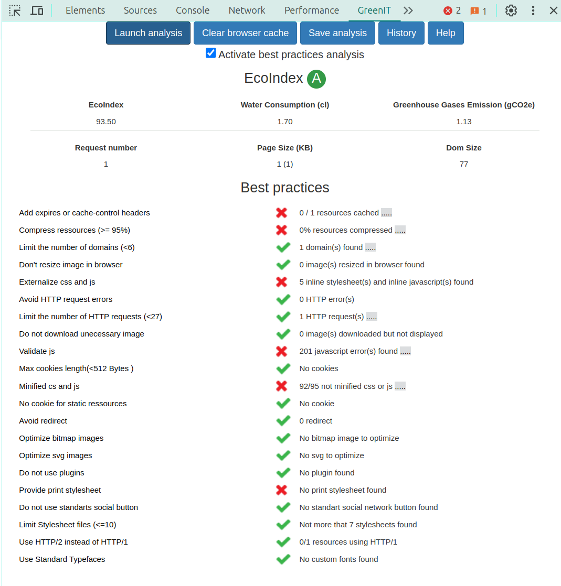

# SR03 - Spring Chat App

## Partie Admin

## Partie Client Chat

### Description de l'architecture

Il s'agit d'une application de chat simple qui permet aux utilisateurs de discuter en temps réel à travers WebSocket.
La partie client de cette application est construite avec :

- React 18 : Une bibliothèque JavaScript pour construire des interfaces utilisateur.
- Node.js : Un runtime JavaScript construit sur le moteur JavaScript V8 de Chrome.
- Shadcn/ui et tailwindcss : Une bibliothèque de composants React et des outils de conception CSS.
- Vite.js : Un outil de build alternatif à Webpack qui vise à fournir une expérience de développement plus rapide et plus simple.
- TanStack React Query v5 : Une bibliothèque pour gérer, mettre en cache, synchroniser et mettre à jour l'état du serveur dans les applications React.
- STOMP over WebSocket : Un simple protocole de messagerie orienté texte sur WebSocket.

### Conception et interactions entre les technologies

#### React

React est utilisé pour construire l'interface utilisateur de l'application. React permet de créer des composants réutilisables et de les combiner pour créer des interfaces utilisateur complexes, tels que `Chatroom`, `CreateChatroom`, `InviteUser`, `Login`, `MyChatrooms`, `MyInvitations`, `PlanDiscussion`, `Profile`, `Sidebar`, `StompListener`...

Les composants React sont utilisés pour afficher l'interface utilisateur de l'application (la partie Chat).

#### Spring

Le backend Spring contient les endpoints pour l'API REST ainsi que les endpoints pour les messages WebSocket. Les messages WebSocket sont envoyés et reçus par le backend Spring. Les messages WebSocket sont écoutés dans le composant `StompListener.jsx` dans la partie client. L'API REST est utilisée pour fetcher les données de l'application (liste de chatrooms, d'utilisateurs...).

#### WebSocket

Pour la partie Client, Les messages WebSocket sont écoutés dans le composant `StompListener.jsx`. Les messages sont écoutés en permanence, et les messages reçus sont stockés dans un useState prop `messages` dans `App.jsx`.  Les messages sont ensuite affichés dans le chatroom correspondant. Le composant `Chatroom.jsx` utilise le prop `messages` dans `App.jsx` et affiche les messages à l'utilisateur.

### Particularités techniques

#### Chatroom

Le composant `Chatroom.jsx` est utilisé pour afficher l'interface de Chat. Les messages sont affichés en sucession, et les nouveaux messages sont ajoutés à la fin. Le composant `Chatroom.jsx` utilise également un champ Input pour envoyer des messages. Les nouveaux messages arrivées sont notifiés à l'utilisateur, et ceci n'est pas dans le composant `Chatroom.jsx` mais dans le composant `StompListener.jsx`.

#### React Query

React Query permet de rafraîchir les données. Sans un mécanisme de rafraîchissement, quand un utilisateur rejoint un salon de chat, crée un salon de chat... par exemple, `StompListener.jsx` n'écouterait pas les nouveaux salons car les données ne seraient pas mises à jour.

React Query permet de gérer ce problème en mettant en cache les données et en les rafraîchissant quand on fait invalidateQueries. Par exemple dans `CreateChatrooms.jsx`, on peut voir comment les données sont rafraîchies après la création d'un nouveau salon de chat :

```jsx

  const queryClient = useQueryClient(); // used to invalidate the query

  const mutation = useMutation({
    // used to send the data to the server
    mutationFn: (payload) => {
      return axios.post(`/api/chatrooms`, payload, {
        headers: {
          Authorization: `Bearer ${sessionStorage.getItem("token")}`,
        },
      });
    },
    onError: (error) => {
      console.log("[CreateChatrooms] onError: ", error);
    },
    onSettled: (data, error) => {
      console.log("[CreateChatrooms] onSettled: ", data, error);
      // invalidate the query to refetch the data
      queryClient.invalidateQueries([
        { queryKey: ["chatrooms"] },
        { queryKey: ["userChatrooms"] },
        { queryKey: ["users"] },
      ]);
    },
  });

```

React Query est utilisé pour gérer les données de l'application. Les données sont fetchées avec des hooks personnalisés dans `src/hooks`. Les données sont fetchées avec Axios, et les données sont mises en cache et synchronisées automatiquement. Les données sont rafraîchies manuellement avec un bouton "Refresh" dans le Sidebar, et automatiquement quand l'utilisateur crée un nouveau salon de chat, quitte un salon de chat... Les mutations (useMutation) sont utilisées directement dans les composants.

### Structure du projet

Le projet React est divisé en plusieurs dossiers :

- `src/hooks` : contient les hooks personnalisés pour fetcher des données, utilisés dans l'application. Ces hooks sont customisés à partir de React Query's useQuery. Les mutations (useMutation) sont utilisées directement dans les composants.
- `src/api` : contient les api utilisées dans `src/hooks`. Ici se trouve les appels aux endpoints de l'API Spring. Les appels sont faits avec Axios (axios.get).
- `src/components` : contient les composants React de l'application
- `index.jsx` : le point d'entrée de l'application. Ici se trouve le composant principal de l'application, `App`. React Strict Mode est activé en permanence.
- `App.jsx` : le composant principal de l'application. Le composant `StompListener` est utilisé pour écouter les messages WebSocket. Les `PrivateWrapper` permet de masquer les liens de navigation si l'utilisateur n'est pas connecté.
- `vite.config.js` : le projet est buildé avec Vite (et pas create-react-app). Ce fichier contient la configuration de Vite.
- `tailwind.config.js` : le fichier de configuration de TailwindCSS, qui est utilisé pour la conception CSS de l'application. Shadcn/ui est également utilisé pour les composants React.

### Lancement de l'application

#### Prérequis

- Le projet est testé sur Node.js version 20.13.1. Vous devez avoir Node.js installé sur votre machine pour exécuter le projet.
- La version de React utilisée est la version 18.3.1, React 17 ne va pas fonctionner à cause de la dépendance de TanStack React Query v5.
- Vite.js est utilisé pour le build du projet et pas Webpack, il faut aller sur [http://localhost:5173](http://localhost:5173) ou [http://localhost:4173](http://localhost:4173) et pas [http://localhost:3000](http://localhost:3000) comme les projets Webpack.

#### Installation

1. Clonez le dépôt :

    ```bash
    git clone https://gitlab.utc.fr/amoudoug/sr03-spring-chat-app.git
    ```

1. Accédez au répertoire du projet :

    ```bash
    cd sr03-spring-chat-app
    ```

1. Accédez au répertoire de la partie serveur :

    ```bash
    cd chatapp
    ```

1. Modifiez / Adaptez le .env (voir .env.example et l'adapter pour y mettre des identifiants valides pour le serveur de base de données) :

    ```bash
    cp .env.example .env
    sudo nano .env
    ```

1. Lancer le backend Spring :

    ```bash
    ./mvnw spring-boot:run
    ```

1. Le backend est lancé, maintenant au frontend. Accédez au répertoire de la partie client :

    ```bash
    cd client
    ```

1. Installez les dépendances :

    ```bash
    npm install
    ```

1. Lancez l'application :

    ```bash
    npm run dev
    ```

1. Ouvrez votre navigateur et accédez à l'URL suivante : [http://localhost:5173](http://localhost:5173)

1. Vous pouvez également faire un build de l'application ( étape 7, 8, 9 optionnel) :

    ```bash
    npm run build
    ```

1. et lancer l'application en mode production :

    ```bash
    npm run serve
    ```

1. Ouvrez votre navigateur et accédez à l'URL suivante (attention au numéro de port 4173 au lieu de 5173) : [http://localhost:4173](http://localhost:4173)

### Fonctionnalités et Utilisations

#### Fonctionnalités demandées

Les fonctionalités demandées sont les suivantes :

- Login : page de connexion pour l'utilisateur implémentée
- Logout : bouton de déconnexion dans le Sidebar (cliquer sur le bouton Profil de l'utilisateur, puis "Logout")
- Liste de chatrooms : page My Chatrooms dans le Sidebar, liste des chatrooms auxquels l'utilisateur appartient
- Liste d'inviations : page My Invitations dans le Sidebar, liste des invitations reçues par l'utilisateur (ne sont pas créees par l'utilisateur lui-même)
- Connexion à un salon de chat dont l'utilisateur fait partie : page My Chatrooms et My Invitations dans le Sidebar
- Envoi de messages : cliquer sur le bouton "Chat" sur la page My Chatrooms ou My Invitations pour ouvrir le salon de chat et envoyer des messages
- Réception de messages : la réception est automatique, il y a également un système de notification mis en place pour informer l'utilisateur de l'arrivée de nouveaux messages
- Déconnexion du salon de chat : cliquer sur le bouton "Quit" sur un chatroom de la page My Chatrooms ou My Invitations pour quitter le salon de chat
- Créer un nouveau salon de chat : cliquer sur l'onglet "Plan a Discussion" dans le Sidebar pour créer un nouveau salon de chat
- Ajouter un utilisateur à un salon de chat : sur l'interface de chat, cliquer sur le bouton "Add User" (à côté du bouton "Users in Chatroom") pour ajouter un utilisateur à un salon de chat
- Test de validité du salon de chat : si un chatroom est expiré ou n'a pas encore commencé, l'utilisateur ne peut pas y accéder.
- Pagination : les listes de chatrooms, d'utilisateurs... sont paginés pour une meilleure expérience utilisateur

#### Fonctionnalités supplémentaires

En plus des fonctionnalités demandées, nous avons également implémenté les fonctionnalités suivantes :

- Notification de chat : une notification est affichée pour informer l'utilisateur de l'arrivée de nouveaux messages, et ceci dans quel chatroom le message a été envoyé, et par qui.
- La capacité de renouveler les données fetchées (liste de chatrooms, d'utilisateurs...) manuellement et automatiquement : cliquer sur le bouton "Refresh" dans le Sidebar. Les données sont également rafraîchies automatiquement quand l'utilisateur crée un nouveau salon de chat, quitte un salon de chat... Cela est fait grâce à la bibliothèque TanStack React Query.
- Dark Mode : l'implémentation partielle (n'est pas stable)
- Sidebar dynamique et application "responsive" : le Sidebar est dynamique et peut devenir un "Sheet" si la taille de l'écran est limitée. L'application est également "responsive" et s'adapte à la taille de l'écran de l'utilisateur.
- Les `PrivateWrapper` permet de masquer les liens de navigation si l'utilisateur n'est pas connecté (voir `App.tsx`).

### Eco Index



L'application obtien un score A. Les problèmes sont les suivants :

- Add expires or cache-control headers : 0 / 1 resources cached .....
- Compress ressources (>= 95%) : 0% resources compressed .
- Externalize css and js : 5 inline stylesheet(s) and inline javascript(s) found
- Validate js : 201 javascript error(s) found .....
- Minified cs and js : 92/95 not minified css or js .....
- Provide print stylesheet : No print stylesheet found

#### Piste d'amélioration

Pour améliorer le score, il faudrait :

- Ajouter des headers expires ou cache-control pour les ressources
- Compresser les ressources
- Externaliser les css et js
- Valider le js
- Minifier les css et js
- Ajouter un print stylesheet
